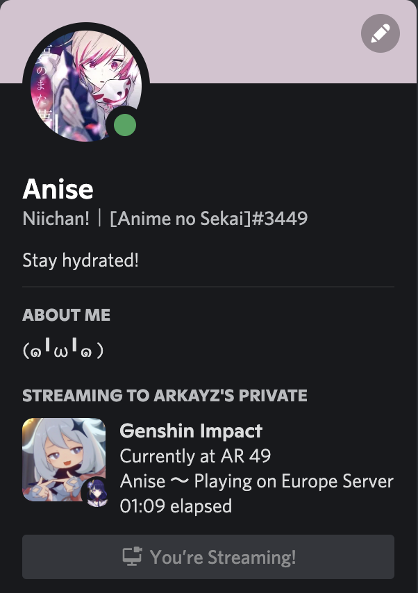

# genshin-presence

A Genshin Impact Rich Presence script

## What is it?

genshin-presence is a little script which helps you show to everyone on Discord that you are playing Genshin and you current Adventure Rank (AR), Server, Favorite Character, etc.



## Prerequisit

### Python

According to vermin, Python 3.4 should be needed to run the script.

```python
# vermin output
Minimum required versions: 3.4
Incompatible versions:     2
```

### Dependencies

You need to install the dependencies in order to properly run the script

```shell
pip install -r requirements.txt
```

## How does it work

### Configuration

You'll first need to configure genshin-prensence for it to work properly

Head to [config.py](./config.py) to configure genshin-presence

In there, you'll see multiple settings that you can tweak to customize your rich presence.

Here is a description of the different fields:

#### Player

> This settings group lets you change which player and which game you want to display on Discord

| Field         | Description                                                                        | Possible Values                                                                          | Notes                                                                                                                                            |
|---------------|------------------------------------------------------------------------------------|------------------------------------------------------------------------------------------|--------------------------------------------------------------------------------------------------------------------------------------------------|
| GAME          | This is the game you want to check and display to your friends on Discord          | `Games.GENSHIN` and `Games.HONKAI`                                                           | Those are the only values available for now but we might add more in the future                                                                  |
| CHARACTER     | This is the character you want to display on your rich presence card               | `Characters.< CHARACTER_NAME>` | All of the playable Genshin characters should be available. We might add more characters in the future                                                                                                       |
| HOYOLAB_UID   | This is the **HoYoLAB** UID of the player you want to display (it can be someone else) | The User ID of the player                                                                | You can find it on the user's profile page, make sure that it's the HoYoLAB UID and **not** the Genshin UID                                                                                                       |
| SERVER_REGION | The region of the game server you want to display the profile for                  | `Servers.EUROPE` or `None`                                                                   | For now only Europe is available because I haven't checked the other regions, you can set to `None` to pick the first one, even if it's not Europe |

#### Text

> This defines the different text fields values on the rich presence card

| Field          | Description                                                | Possible Values         | Notes                                                                             |
|----------------|------------------------------------------------------------|-------------------------|-----------------------------------------------------------------------------------|
| TEXT           | This the text displayed when the game icon is hovered      | Any "string" of character | N/A                                                                               |
| CHARACTER_TEXT | This the text displayed when the character icon is hovered | Any "string" or `None`      | If `None`, it will be defined as "My favorite character is <CHOSEN_CHARACTER_NAME>" |

#### Settings

> This defines genshin-presence system settings

| Field        | Description                                                                                | Possible Values                               | Notes                                                |
|--------------|--------------------------------------------------------------------------------------------|-----------------------------------------------|------------------------------------------------------|
| REFRESH_RATE | This is the rate at which it will fetch data from HoYoLAB and update it on Discord         | A number                                      | This is in seconds. Do no set a value too low (1 second for example) to avoid getting rate limited by MiHoYo                                   |
| COOKIE       | This is a very important parameter, which allows genshin-presence to fetch data on HoYoLAB | A "string" containing the cookie header value | Refer to the [Cookie](#cookie) section for more info |

### Cookie

While configuring genshin-presence you need set `Settings.COOKIE` in order for genshin-presence to work.

> `Settings.COOKIE` allows genshin-presence to fetch any data from HoYoLAB.

You will need to head to the [HoYoLAB](https://www.hoyolab.com) website and login.

Once logged in, [open the DevTools](https://support.airtable.com/hc/en-us/articles/232313848-How-to-open-the-developer-console) and go to the `Requests` (or similar) section.

Search for any request with the domain/host: `bbs-api-os.hoyolab.com`

> example: https://bbs-api-os.hoyolab.com/community/misc/wapi/langs

It should contain a `Cookie` value inside the "Header" section of the request.

> example: ltoken=1Kj/////uYXuY....................N2hMrN9; ltuid=7...56..; _MHYUUID=d033....-..29-..67-..1d-.....357....; _ga=GA1.2.???831????.1..124....; _gid=GA1.2.3..08.....1641....86; mi18nLang=en-us; account_id=718....8; cookie_token=3zLCk....4i????3Q?????nk86..........c1??

Copy this `Cookie` value and paste it in `Settings.COOKIE`.

> I don't know why but HoYoLAB doesn't allow making any request (wether it's to fetch user data, or normal data) without this header, while it's kind of available to everyone.

### Discord

You'll now need to have Discord opened in order to connect properly.

### Run the script

You can now run the script to connect to Discord and show that you are playing.

```shell
python presence.py
```

## Editing the configuration file (config.py)

You can edit the configuration file even with the script running.

presence.py will reload the configuration file on every update so the new values should be updated without quitting and restarting the script.

## License

This project is licensed under the MIT License - see the [LICENSE](./LICENSE) file for details

> © Anime no Sekai, 2022 ✨
