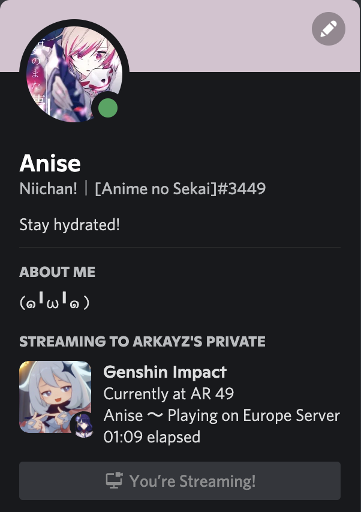
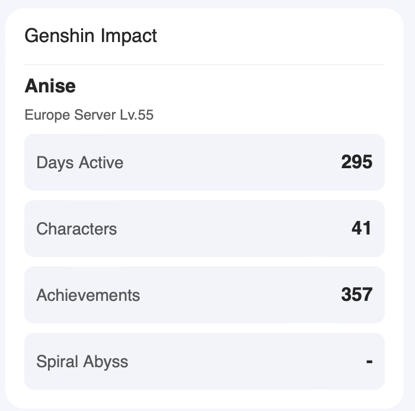

# genshin-presence

A Genshin Impact Rich Presence script

## What is it?

genshin-presence is a little script which helps you show to everyone on Discord that you are playing Genshin and you current Adventure Rank (AR), Server, Favorite Character, etc.



## Prerequisites

### Python

According to vermin, Python 3.7 should be needed to run the script.

```python
# vermin output
Minimum required versions: 3.7
Incompatible versions:     2
```

### Dependencies

You need to install the dependencies in order to properly run the script

```shell
pip install --upgrade -r requirements.txt
```

## How does it work

### Configuration

You'll first need to configure genshin-prensence for it to work properly

Head to [config.py](./config.py) to configure genshin-presence

In there, you'll see multiple settings that you can tweak to customize your rich presence.

Here is a description of the different fields:

#### Player

> This settings group lets you change which player and which game you want to display on Discord

| Field         | Description                                                                        | Possible Values                                                                          | Notes                                                                                                                                            |
|---------------|------------------------------------------------------------------------------------|------------------------------------------------------------------------------------------|--------------------------------------------------------------------------------------------------------------------------------------------------|
| GAME          | This is the game you want to check and display to your friends on Discord          | `Games.GENSHIN` and `Games.HONKAI`                                                           | Those are the only values available for now but we might add more in the future                                                                  |
| CHARACTER     | This is the character you want to display on your rich presence card               | `Characters.< CHARACTER_NAME>` | All of the playable Genshin characters should be available. We might add more characters in the future                                                                                                       |
| HOYOLAB_UID   | This is the **HoYoLAB** UID of the player you want to display (it can be someone else) | The User ID of the player                                                                | You can find it on the user's profile page, make sure that it's the HoYoLAB UID and **not** the Genshin UID                                                                                                       |
| SERVER_REGION | The region of the game server you want to display the profile for                  | `Servers.EUROPE` or `None`                                                                   | For now only Europe is available because I haven't checked the other regions, you can set to `None` to pick the first one, even if it's not Europe |

#### Text

> This defines the different text fields values on the rich presence card

| Field          | Description                                                         | Possible Values            |
|----------------|---------------------------------------------------------------------|----------------------------|
| STATE_TEXT           | This is the state text that will be displayed                 | Any "string" of characters |
| DETAILS_TEXT         | This is the details text that will be displayed               | Any "string" of characters |
| HOVER_TEXT           | This is the text displayed when the game icon is hovered      | Any "string" of characters |
| HOVER_CHARACTER_TEXT | This is the text displayed when the character icon is hovered | Any "string" of characters |

> [!TIP]  
> You can use variables in the text fields to display dynamic values :
>
> - `{name}`: The nickname of the player
> - `{region}`: The name of the region the player is playing on
> - `{level}`: The level (Adventure Rank) of the player
> - `{character}`: The character the player is playing
> - `{game}`: The game the player is playing
>
> Example: `Playing as {character} on {game}`

#### Settings

> This defines genshin-presence system settings

| Field        | Description                                                                                | Possible Values                               | Notes                                                |
|--------------|--------------------------------------------------------------------------------------------|-----------------------------------------------|------------------------------------------------------|
| REFRESH_RATE | This is the rate at which it will fetch data from HoYoLAB and update it on Discord         | A number                                      | This is in seconds. Do no set a value too low (1 second for example) to avoid getting rate limited by MiHoYo                                   |
| DISCORD_APPLICATION_ID       | This shouldn't need to be changed but if you want to customise the images and all you can create your own and put it in here | An integer with your Application ID | To obtain one, you need to create an app on the Discord Developer Portal |
| COOKIE       | This is a very important parameter, which allows genshin-presence to fetch data on HoYoLAB. This is optional if you use other methods to save the cookie. | A "string" containing the cookie header value | Refer to the [Cookie](#cookie) section for more info |

### Cookie

While configuring genshin-presence you need set `Settings.COOKIE` in order for genshin-presence to work.

> `Settings.COOKIE` allows genshin-presence to fetch any data from HoYoLAB.

There are 2 methods to get the cookie

#### Method 1: Using `get_cookie.py`

You can use the `get_cookie.py` script to get the cookie value.

```shell
python get_cookie.py
```

It will open a browser window with HoYoLAB opened.

You will need to login and head to the profile page of anyone with a game card.

Once a game card is detected on the screen, it will automatically close the browser and save the cookie in a `COOKIE` file.

> [!TIP]  
> You don't need to copy it in the `config.py` file, it will be automatically loaded when running `presence.py`.

You can also change the browser and executable path when running `get_cookie.py` :

```shell
$ python get_cookie.py --help
usage: get_cookie.py [-h] [--browser {chromium,firefox,webkit}] [--executable EXECUTABLE]

Get the cookie from the HoYoLAB website

options:
  -h, --help            show this help message and exit
  --browser {chromium,firefox,webkit}
                        The browser to use (default: chromium)
  --executable EXECUTABLE
                        The path to the browser executable (optional)
```

> [!NOTE]  
> If the `executable` path is not set, Playwright will use its own installed browser (it might ask you to install them if it's not already installed)

#### Method 2: Manually

You will need to head to the [HoYoLAB](https://www.hoyolab.com/accountCenter/postList?id=71845688) website and login.

Once logged in, you should see the "Game cards" on the right side.



Open the [DevTools](https://support.airtable.com/hc/en-us/articles/232313848-How-to-open-the-developer-console) and go to the `Requests/Network` (or similar) tab.

Search for requests to `https://bbs-api-os.hoyolab.com/game_record/card/wapi/getGameRecordCard` (you can reload the page to get the request).

It should contain a `Cookie` value inside the *"Header"* section of the request.

> example: ltoken=1Kj/////uYXuY....................N2hMrN9; ltuid=7...56..; _MHYUUID=d033....-..29-..67-..1d-.....357....;_ga=GA1.2.???831????.1..124....; _gid=GA1.2.3..08.....1641....86; mi18nLang=en-us; account_id=718....8; cookie_token=3zLCk....4i????3Q?????nk86..........c1??

Copy this `Cookie` value and paste it in `Settings.COOKIE`.

> I don't know why but HoYoLAB doesn't allow making any request (whether it's to fetch user data, or normal data) without this header, while it's kind of available to everyone.

### Run the script

> [!WARNING]  
> You'll now need to have Discord opened in order to connect properly.

You can now run the script to connect to Discord and show that you are playing.

```shell
python presence.py
```

> [!TIP]  
> You can edit the configuration file ***even while the script is running***.  
> `presence.py` will reload the configuration file on every update so the new values should be updated without quitting and restarting the script.

### Use in Python

You can also use `GenshinPresence` in your own Python script.

```python
import config
from presence import GenshinPresence

presence = GenshinPresence(config=config)
presence.run()
```

Note that every step is separated in different methods so you can call them separately.

You can find the different methods in the [presence.md](./docs/presence.md) file.

## License

This project is licensed under the MIT License - see the [LICENSE](./LICENSE) file for details

> © Anime no Sekai, 2024 ✨
